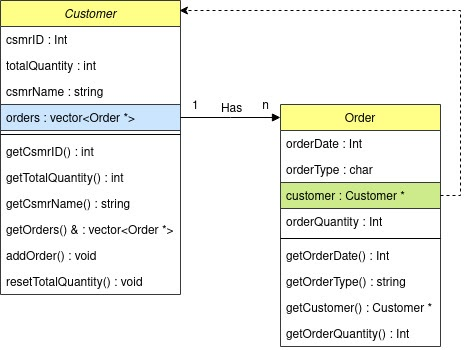

# order-processing-system  
A customer order processing system to showcase C++ programming skills as a Summative Assessment.
  
## Content
 - [How To Run?](#How-To-Run?)
   - [Requirements](#Requirements)
 - [Scenario](#Scenario)
 - [Design](#Design)
   - [Assumptions](#Assumptions)
   - [Classes](#Classes)
 - [Input File Regex (Records)](#Input-File-Regex-(Records))
   - [New Customer](#New-Customer)
   - [Sales Order](#Sales-Order)
   - [End-of-day](#End-of-day)
     - [Example](#Example)
 - [Task TODO List](#Task-TODO-List)
   - [Test For Memory Leaks (Valgrind)](#Test-For-Memory-Leaks-(Valgrind))
   - [Handling the Input File](#Handling-the-Input-File)
   - [Using the Input Data](#Using-the-Input-Data)
   - [Handling Output](#Handling-Output)
  
## How To Run?
In a terminal...
 * Navigate to the `order-processing-system` directory
 * compile the program with command: `./compileOP`
 * then run the program with command: `bin/./ordering testInputFile.txt`
 * IF you have your own test file then replace `testInputFile.txt`
  
**NOTE:** `ordering` will compile for a linux machine
  
### Requirements
 * C++11
 * g++ (compiler)
  
## Scenario  
Customer's place multiple orders during each day. (represented by an input file)  
At the end of each day the orders are collated and each customer’s total order quantity is sent to them as a single shipment.  
If a customer places an “express” order, then it and all its outstanding orders for the day are sent immediately (bypasses end of day).  
When a shipment is triggered for a customer, they are notified that a shipment is on its way, and an invoice is sent to them.  
  

## Design
Outline of the assumptions and class design.
  
### Assumptions
| X |  Assumption                                                                                             |
|--:| :--                                                                                                     |
| 1 | A single input file populated with data will be the only source of data the program processes           |
| 2 | The input file dates will correctly be in the format YYYYMMDD and nothing else.                         |
| 3 | Any extra characters after the initial input line will be whitespace and thus ignored.                  |
| 4 | An input line not starting with ‘C’, ‘S’, or ‘E’ should be considered invalid and halt the program.     |
| 5 | There cannot be any duplicate customers and upon finding one an error should be given.                  |
| 6 | All orders have a customer number for an already existing customer otherwise an error should be given.  |
| 7 | All orders are exclusively either ‘normal’ or ‘EXPRESS’ and any other type is considered invalid.       |
| 8 | All order quantities will be greater than zero.                                                         |
  
### Classes
There are two classes used in the program.
  
**Customer Class ( customer.hpp, customer.cpp )**  
Customer has been designed to hold a pointer for every new order created. Upon a customer being shipped their orders the pointers are used to iterate through and delete every order associated with the customer.  
Note, the Customer class does not delete orders directly but instead is used to get all its orders.  
  
The design choice to store order object pointers was for two reasons:  
It would model a design similar to a relational database, each order pointer mimics a forign key.  
With all associated orders for a single given customer being held in a collection of pointers, managing the program's memory becomes far more streamlined. All orders allocated as “new” are stored as pointers within their customers.  
  
**Order Class ( order.hpp, order.cpp )**  
Order stores all data from the input line as variables except the customer number. Instead the customer number is replaced with a pointer to the actual customer instance, since [Assumptions](#Assumptions) states “orders have a customer number for an already existing customer” and thus it makes more sense to have a pointer.  
Additionally by having an order point to its associated customer instance, all computations involving retrieving the order’s customer details are removed as we have a direct reference to said customer.  
To better demonstrate the design see the UML diagram...  
  

  
## Input File Regex (Records)
Here are the details for each type of record.  
  
### New Customer
| Column | Datatype  | Description                                   |
| --:    | :-:       | :--                                           |
| 1      | char      | start with 'C'                                |
| 2-5    | int       | customer number; a four digit, zero-padded    |
| 6-45   | string    | customer’s name                               |
  
### Sales Order
| Column | Datatype  | Description                                   |
| --:    | :-:       | :--                                           |
| 1      | char      | start with 'S'                                |
| 2-9    | int       | order date (YYYYMMDD)                         |
| 10     | char      | 'N' = normal order; 'X' = express order       |
| 11-14  | int       | customer number (customer raising the order)  |
| 15-17  | int       | order quantity; three-digits, zero-padded     |
  
### End-of-day
| Column | Datatype  | Description                                   |
| --:    | :-:       | :--                                           |
| 1      | char      | start with 'E'                                |
| 2-9    | int       | date (YYYYMMDD); marks the end of the day     |
  
#### Example
  
**Input File**
| Line | Contents                             | 
| --:  | :--                                  |
| 1    | C0001Royal Devon & Exeter Hospital   |
| 2    | C0002Derriford Hospital              |
| 3    | C0003Torbay Hospital                 |
| 4    | S20210201N0001040                    |
| 5    | S20210201N0001050                    |
| 6    | E20210201                            |
| 7    | S20210202N0001040                    |
| 8    | S20210202N0001060                    |
| 9    | S20210202N0002050                    |
| 10   | S20210202N0002170                    |
| 11   | E20210202                            |
| 12   | S20210203N0001050                    |
| 13   | S20210203N0002065                    |
| 14   | S20210203N0003150                    |
| 15   | S20210203X0001190                    |
| 16   | S20210203N0002110                    |
| 17   | E20210203                            |
  
**Resulting Output Stream**
| Line   | Contents                                         | 
| --:    | :--                                              |
| 1      | OP: customer 0001 added                          |
| 2      | OP: customer 0002 added                          |
| 3      | OP: customer 0003 added                          |
| 4      | OP: customer 0001:  normal order:  quantity 40   |
| 5      | OP: customer 0001:  normal order:  quantity 50   |
| 6      | OP: end of day 20200201   OP: customer 0001:  shipped quantity 90   SC: customer 0001:  invoice 1000:  date 20200201:  quantity:  90   |
| 7      | OP: customer 0001:  normal order:  quantity 40   |
| 8      | OP: customer 0001:  normal order:  quantity 60   |
| 9      | OP: customer 0002:  normal order:  quantity 50   |
| 10     | OP: customer 0002:  normal order:  quantity 170  |
| 11     | OP: end of day 20200202   OP: customer 0001:  shipped quantity 100   SC: customer 0001:  invoice 1001:  date 20200202:  quantity:  100   OP: customer 0002:  shipped quantity 220   SC: customer 0002:  invoice 1002:  date 20200202:  quantity:  220  |
| 12     | OP: customer 0001:  normal order:  quantity 50   |
| 13     | OP: customer 0002:  normal order:  quantity 65   |
| 14     | OP: customer 0003:  normal order:  quantity 150  |
| 15     | OP: customer 0001:  EXPRESS order:  quantity 190   OP: customer 0001:  shipped quantity 240   SC: customer 0001:  invoice 1003:  date 20200203:  quantity:  240  |
| 16     | OP: customer 0002:  normal order:  quantity 110  |
| 17     | OP: end of day 20200203   OP: customer 0002:  shipped quantity 175   SC: customer 0002:  invoice 1004:  date 20200203:  quantity:  175   OP: customer 0003:  shipped quantity 150   SC: customer 0003:  invoice 1005:  date 20200203:  quantity:  150  |
  
## Task TODO List
Each checkbox represents...
 * [ ] To be implemented
 * [x] Implementation complete
  
### Test For Memory Leaks (Valgrind)
Command Line: `valgrind -s --leak-check=yes bin/./ordering testInputFile.txt`
 * [x] All memory leaks resolved
  
### Handling the Input File
 * [x] read CL parameters (for the file name)
 * [x] process data for...
   - new customers
   - sales orders
   - end-of-day
  
### Using the Input Data
Sales order records can be normal or express orders.  
Each record results in one of 4 following actions:  
Add a new...
 * [x] customer (with unique id)
 * [x] "normal" order :
   - quantity is added to the customer's order total
 * [x] express order :
   - quantity is added to the customer's order total,
   - then; total quantity is shipped to the customer,
   - finally; the customer's order quantity is then reset to 0.
 * [x] End-of-day processing :
   - ( only for customers who have orders > 0 )
   - total quantity is shipped to the customer,
   - then; the customer's order quantity is then reset to 0.
  
### Handling Output
Messages are sent to the output stream.  
The following prefix delcares the messages were generated from...
 * [x] OP: the order processing system
 * [x] SC: a customer
  
A message will be generated for each event...
 * [x] new customer is added
 * [x] new normal order is processed
 * [x] new express order is processed
 * [x] shipment is sent to a customer
 * [x] end of a day has been reached
 * [x] (customer message) customer receives an invoice
